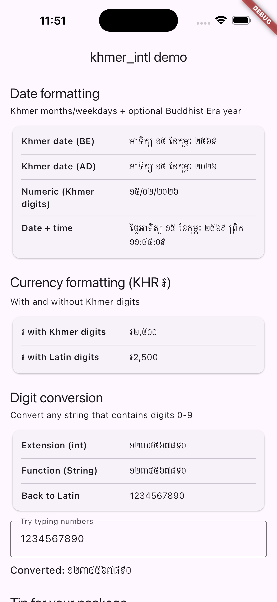
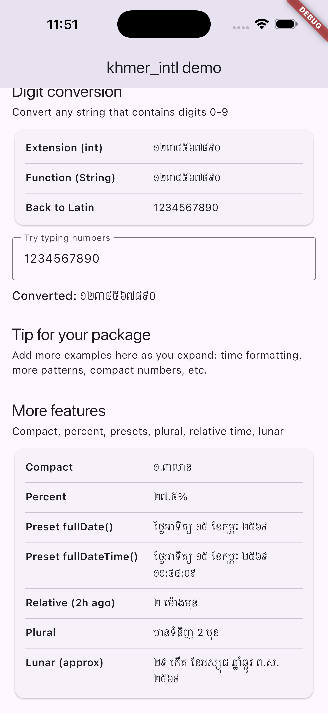

# khmer_intl

Khmer (`km`) internationalization helpers for Dart and Flutter.

`khmer_intl` gives you Khmer-friendly formatting utilities for digits, numbers, currency, dates, relative time, plural selection, and an approximate lunar date model.

## Preview

<p align="center">
  
  
</p>

## Features

- Latin digit -> Khmer digit conversion (`123` -> `១២៣`)
- Khmer digit -> Latin digit conversion
- Number formatting and KHR currency formatting (`៛`)
- Compact number formatting (e.g. `1.3លាន`)
- Percent formatting
- Khmer date formatting with month/weekday names
- Buddhist Era year option (`AD + 543`)
- Date preset constructors (`shortDate`, `mediumDate`, `fullDate`, `fullDateTime`)
- Khmer relative time (e.g. `២ ម៉ោងមុន`)
- Simple plural helper
- Approximate Khmer lunar date model
- Extension methods for `int`, `num`, `String`, and `DateTime`

## Installation

```yaml
dependencies:
  khmer_intl: ^0.1.0
```

Then run:

```bash
dart pub get
```

or (Flutter):

```bash
flutter pub get
```

## Quick Start

```dart
import 'package:khmer_intl/khmer_intl.dart';
```

### Digits

```dart
toKhmerDigits('1234567890');
// ១២៣៤៥៦៧៨៩០

'២០២៦'.toLatinDigits();
// 2026
```

### Number and Currency

```dart
2500.toKhmerCurrency(useKhmerDigits: true);
// ៛២,៥០០

1250000.toKhmerCompact(useKhmerDigits: true);
// ១.៣លាន

0.275.toKhmerPercent(useKhmerDigits: true, fractionDigits: 1);
// ២៧.៥%
```

### Date Formatting

```dart
final date = DateTime(2026, 4, 14);

KhmerDateFormat('EEE dd MMMM yyyy', buddhistEra: true, useKhmerDigits: true)
    .format(date);
// អង្គារ ១៤ ខែមេសា ២៥៦៩

KhmerDateFormat.fullDate(buddhistEra: true, useKhmerDigits: true).format(date);
KhmerDateFormat.fullDateTime(useKhmerDigits: true).format(DateTime.now());
```

### Relative Time

```dart
final now = DateTime.now();
final past = now.subtract(const Duration(hours: 2));

past.toKhmerRelativeTime(reference: now, useKhmerDigits: true);
// ២ ម៉ោងមុន
```

### Plural Helper

```dart
khmerPlural(
  2,
  one: 'មានទំនិញ 1 មុខ',
  other: 'មានទំនិញ 2 មុខ',
);
```

### Lunar Date (Approximate)

```dart
final lunar = KhmerLunarDate.fromGregorian(DateTime.now());
print(lunar);
```

## Core APIs

### Top-level functions

- `toKhmerDigits(String input)`
- `toLatinDigits(String input)`
- `khmerPlural(num count, {required String one, required String other})`

### Formatters

- `KhmerNumberFormat.decimal(...)`
- `KhmerNumberFormat.currencyKHR(...)`
- `KhmerCompactNumberFormat(...)`
- `KhmerPercentFormat(...)`
- `KhmerDateFormat(pattern, ...)`
- `KhmerDateFormat.shortDate(...)`
- `KhmerDateFormat.mediumDate(...)`
- `KhmerDateFormat.fullDate(...)`
- `KhmerDateFormat.fullDateTime(...)`
- `KhmerRelativeTime.format(...)`

### Extensions

- `int.toKhmerDigits()`
- `String.toKhmerDigits()`
- `String.toLatinDigits()`
- `num.toKhmerCurrency(...)`
- `num.toKhmerCompact(...)`
- `num.toKhmerPercent(...)`
- `DateTime.toKhmerDate(...)`
- `DateTime.toKhmerRelativeTime(...)`

## Flutter LocalizationsDelegate

A working Khmer `LocalizationsDelegate` example is included in:

- `example/lib/khmer_localizations.dart`
- `example/lib/main.dart`

## Notes

- Khmer lunar support is currently **approximate** (starter implementation).
- Compact/percent styles are designed to be practical and lightweight.

## Testing

```bash
dart test
```

## License

MIT

### Sponsor Me

If you find my projects helpful and want to support my work, you can sponsor me! 💖

### GitHub Sponsors

[](https://github.com/sponsors/emdiya)

### Connect with Me

[](https://t.me/emdiya)

### Make a Donation

[](https://pay.ababank.com/juhXjRpfGifNJkHM6)

---

<p align="left">
  <a href="https://github.com/emdiya">
    
  </a>
  <br />
  <a href="https://github.com/emdiya">
    
  </a>
</p>
